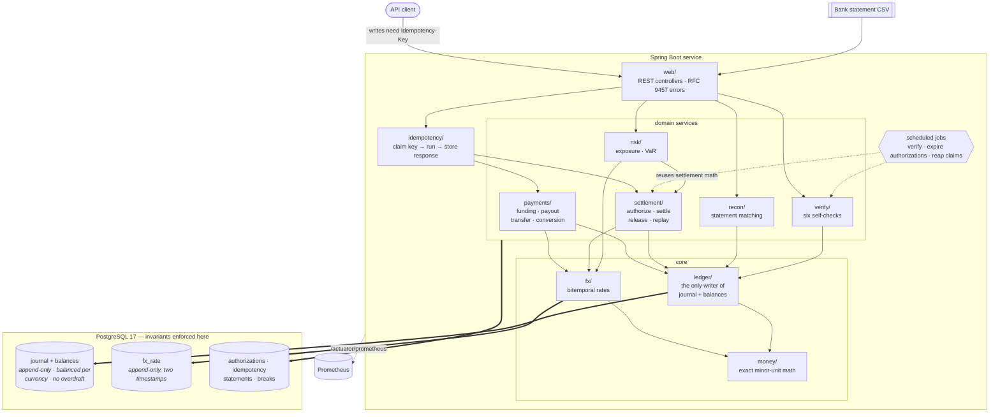
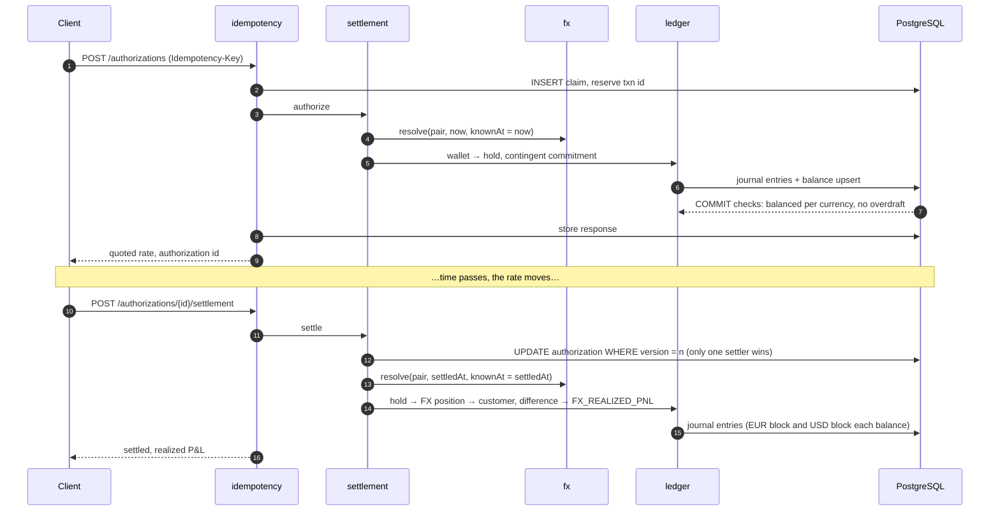

# Multi-Currency Settlement Ledger

An append-only double-entry ledger that holds several currencies at once, prices conversions
from bitemporal FX rates, measures the exposure carried between authorization and settlement,
and reconciles itself against external bank statements.

Java 21 · Spring Boot 3.5 · PostgreSQL 17 · Flyway · Testcontainers · Prometheus

```bash
make up     # Postgres + the service + Prometheus
make demo   # walk one trade from funding through settlement and reconciliation
make verify # ask the ledger to prove its own books add up
make test   # 98 tests against a real Postgres
```

---

## The idea in one paragraph

Money systems go wrong in a small number of specific ways: a retry posts the same transfer
twice, two concurrent withdrawals both pass the same balance check, a currency conversion
loses a cent that nobody can find, a rate correction silently rewrites last month's reports.
This project is built around making each of those *structurally impossible* rather than
merely unlikely — mostly by pushing the guarantee down into PostgreSQL, where no future code
path can route around it.

## What is actually interesting here

| | |
|---|---|
| **Balance is a database constraint, not a code path** | A deferred constraint trigger checks that debits equal credits, per currency, at `COMMIT`. A bug in the service, a migration script, or somebody at a `psql` prompt cannot write an unbalanced transaction. |
| **One transaction, two currencies, balanced in each** | A conversion's halves meet at an FX position account rather than being compared across units, so neither half can be unbalanced by a rate. |
| **The FX rate move has its own account** | The difference between the quoted rate and the settlement rate is posted to realized FX P&L — the number a pricing desk needs, visible instead of buried in a customer balance. |
| **Overdraft protection without application locking** | The balance projection is an upsert on one row per account, so concurrent writers to the same account serialise on a row lock. 25 simultaneous withdrawals against a balance that affords 10 result in exactly 10 successes, under plain `READ COMMITTED`. |
| **Idempotency that survives a crash mid-request** | The claim reserves its transaction id *before* doing the work, so after a crash the reaper can ask the journal whether the write actually landed, rather than guessing. |
| **Bitemporal rates, so corrections don't rewrite history** | Separate "when the price held" and "when we learned it". Restating a settlement is the ordinary settlement calculation re-run with the knowledge time moved forward — not a parallel correction code path. |
| **A reconciliation engine that classifies breaks** | Five named break types; three are resolved automatically, two are deliberately left for a human because closing them would mean guessing. |
| **The ledger verifies itself** | A scheduled job recomputes every balance from the journal and cross-checks open authorizations against the accounts backing them. `ledger_trial_balance_residual` is the one metric worth paging on. |

---

## Architecture



**Reading it top to bottom.** Every write that moves money (payments, authorizations, reversals)
passes through `idempotency/` first: the key is claimed with an `INSERT` (so two concurrent
retries cannot both win), the domain service runs, and the response is stored for replay. Domain services never write tables directly for money
movements — they build postings and hand them to `ledger/`, which is the only writer of
`journal_entry` and the balance projection. `fx/` supplies rates, `money/` does all the arithmetic,
and neither touches balances.

**The bottom layer is the safety net.** Conservation of money, append-only history, currency
matching and overdraft protection are enforced by triggers and constraints in PostgreSQL itself
([V1–V8](src/main/resources/db/migration/)), so the arrows into the database are the only path
that matters. A code path added later that skips `ledger/` still cannot write an unbalanced
transaction.

**The loop closes on itself.** `risk/` reuses the settlement conversion so unrealized exposure
becomes realized P&L exactly at settlement; `verify/` recomputes everything from the journal on a
schedule and exports the result as metrics; `recon/` compares the journal against the bank's view.

### Life of an FX authorization



---

## The invariants, and where each one is enforced

Everything in this table is enforced by PostgreSQL. The application checks several of them
too, but only so the error message can name the currency and the amount — the database is
what makes the guarantee true.

| Invariant | Mechanism | Test |
|---|---|---|
| Debits = credits, per currency, per transaction | `CONSTRAINT TRIGGER … DEFERRABLE INITIALLY DEFERRED` ([V2](src/main/resources/db/migration/V2__journal.sql)) | `databaseRejectsUnbalanced` |
| A transaction may be unbalanced mid-flight, never at commit | the same trigger, deferred | `balanceIsCheckedAtCommitNotPerRow` |
| Entries are never updated or deleted | `BEFORE UPDATE OR DELETE` trigger that raises | `journalIsAppendOnly` |
| An entry's currency matches its account's | composite foreign key on `(account_id, currency_code)` | `entryCurrencyMustMatchAccount` |
| Amounts are always positive; sign lives in the direction | `CHECK (amount_minor > 0)` | `amountsAreAlwaysPositive` |
| Wallets cannot be overdrawn | deferred constraint trigger, under the projection's row lock ([V3](src/main/resources/db/migration/V3__balance_projection.sql)) | `walletCannotGoNegative`, `oversubscriptionCannotOverdraw` |
| Overdraft depends on the end state, not leg order | the check is deferred to commit | `overdraftIsCheckedAtCommit` |
| One settlement per authorization | version check on the `UPDATE`, taken before the postings | `concurrentSettlementPaysOnce` |
| At most one write per idempotency key | primary key on `(scope, idempotency_key)` | `concurrentDuplicatesExecuteOnce` |
| Published rates are immutable | append-only trigger on `fx_rate` | `ratesAreAppendOnly` |

Balances are stored as a signed debit-minus-credit figure, which buys one very strong global
property: **for every currency, the sum of all account balances is exactly zero.** That is what
`GET /api/v1/trial-balance` returns, what the verifier recomputes from the journal, and what
every test asserts after it finishes.

---

## How a currency conversion stays balanced

The hard part of a multi-currency ledger is that a single transaction has to move two
currencies and still balance. It cannot balance "overall" — there is no exchange rate at which
¥1,000,000 *equals* €6,000 for accounting purposes. It balances **in each currency separately**,
which works because the two halves are joined through a pivot account rather than being
compared to each other.

A settlement where the rate moved from the quoted 1.10 to 1.15, on €1,000.00:

| Account | Currency | Dr | Cr | Why |
|---|---|---|---|---|
| `LIABILITY:CUSTOMER_HOLD:alice:EUR` | EUR | 100000 | | the hold becomes ours |
| `EQUITY:FX_POSITION:EUR` | EUR | | 100000 | we are now long EUR |
| | | **100000** | **100000** | EUR balances on its own |
| `EQUITY:FX_POSITION:USD` | USD | 115000 | | what the market delivers at 1.15 |
| `LIABILITY:CUSTOMER:alice:USD` | USD | | 110000 | the customer gets the 1.10 they were quoted |
| `EQUITY:FX_REALIZED_PNL:USD` | USD | | 5000 | the rate move, now a fact |
| `CONTINGENT:FX_COMMITMENT:USD` | USD | 110000 | | the obligation is discharged |
| `CONTINGENT:FX_COMMITMENT_CONTRA:USD` | USD | | 110000 | |
| | | **225000** | **225000** | USD balances on its own |

Read the USD block again: the customer is paid exactly what they were promised, and the
*difference between the promise and the market* lands in its own account. A negative balance
there means the spread on the quote was too thin — which is precisely the number a pricing
desk wants, and it is only legible because it was given an account instead of being absorbed
into somebody's balance.

### Where rounding goes

When a pair isn't quoted directly — JPY/KWD, say — the rate is composed through USD. The pivot
leg has to be rounded to a bookable amount before the second leg is applied, so the two-leg
result differs from the exact cross rate by a whole minor unit or two. That residual is real
money and is posted to `EQUITY:FX_ROUNDING`, keeping rounding drift separable from trading
result:

```
booked + residual = market value
```

That identity is asserted as a property over thousands of generated inputs
([`MoneyProperties`](src/test/java/com/tribule/ledger/property/MoneyProperties.java)), because
if it can ever fail, the buy side of a settlement doesn't balance and the database rejects the
write.

Also: amounts are `bigint` counts of minor units, never floats, and the scale comes from a
currency table — JPY has 0 decimals, USD 2, KWD 3. Rounding is `HALF_EVEN`, because `HALF_UP`
is biased upward and applied to millions of conversions that bias is a real, auditable loss.

---

## Settlement risk

An authorization is a promise: a rate quoted now, currency delivered later. Between those two
moments the house carries the difference. Authorizing therefore does two separate things:

1. **Reserves real money.** The customer's funds move from their wallet into a hold account in
   the same currency. Both legs balance, nothing is created, and "insufficient funds" is
   enforced by the database rather than by a check another request could race.
2. **Records an obligation that is not yet a cash movement.** No buy currency has moved, so
   booking it to the balance sheet would be a lie. It goes to contingent accounts — real
   double-entry accounts that balance per currency but sit off the balance sheet.

`GET /api/v1/risk/exposure` then marks those open authorizations to market. The claim that makes
it trustworthy is that exposure is not a second model sitting beside the ledger — it is the
settlement calculation with one input swapped:

```
settlement:  realized   = convert(sellAmount, rate at settlement) - quotedAmount
exposure:    unrealized = convert(sellAmount, rate now)           - quotedAmount
```

Same inputs, same conversion code, same rounding. So the moment an authorization settles, its
unrealized number *becomes* its realized number, and the risk report and the books reconcile by
construction. That equality is a test
([`unrealizedBecomesRealized`](src/test/java/com/tribule/ledger/risk/ExposureServiceTest.java)) —
a risk number that can disagree with the ledger is worse than no number.

The report also gives a net position per currency (long what we are owed, short what we
promised) and a one-day historical-simulation VaR. The VaR is deliberately the simplest
defensible method — observed daily log returns, read off at the 95th percentile, applied to the
current notional — and each estimate carries its own limits in a `method` field. The portfolio
figure sums the per-pair numbers and claims no correlation benefit, which is stated rather
than hidden.

---

## Bitemporal rates and correction replay

Every rate observation carries two independent timestamps:

- `effective_at` — when this price held in the market (valid time)
- `observed_at` — when we learned about it (transaction time)

A vendor correcting yesterday's bad tick inserts a **new row** with yesterday's `effective_at`
and today's `observed_at`. The wrong row is never edited, so a report produced yesterday can
still be reproduced exactly as it was. One timestamp cannot express that, which is why systems
without it end up correcting history by hand.

The payoff is how little machinery restatement needs:

```java
// originally
resolve(pair, effectiveAt = settledAt, knownAt = settledAt);
// on replay
resolve(pair, effectiveAt = settledAt, knownAt = now);
```

Same function, same valid time; only the knowledge time moves, and the corrected observation
comes back. `POST /api/v1/fx/rates/corrections/{id}/replay` re-runs the settlement arithmetic and
posts an *adjusting* transaction beside the original. **Customer balances are untouched** — they
were quoted a rate and paid that rate, and a vendor's bad tick is not their problem — so only
the house's own FX position, realized P&L, and rounding accounts move.

Rate resolution itself tries four things in order and records which one it used, because a
triangulated rate rounds differently from a direct one: identity → the quoted pair → the
reciprocal of the opposite pair → composition through the pivot currency.

---

## Reconciliation

The ledger is our opinion about what happened; the bank statement is theirs. Both are wrong
sometimes and they are never in step, so the job is not to force the numbers to agree — it is to
account for every difference *by name*. "We are out by 4,312 JPY" is not actionable; "the bank
sent this reference twice and this payment hasn't reached them yet" is two tickets with two
different owners.

| Break | What it means | Action |
|---|---|---|
| `DUPLICATE_IN_STATEMENT` | the bank sent one reference twice | **auto** — ignore the second occurrence |
| `TIMING_DIFFERENCE` | reference and amount agree, value date is outside tolerance | **auto** — nothing is wrong |
| `MISSING_IN_LEDGER` | money moved in our bank account and we don't know why | **auto** — post it to suspense so the books agree with the bank; the suspense balance becomes the open item |
| `AMOUNT_MISMATCH` | same reference, different money | **open** — somebody has to decide which side is right |
| `MISSING_IN_STATEMENT` | we booked it, the bank hasn't reported it | **open** — in flight, or lost |

The last two are left open on purpose. A matcher that closed them would be manufacturing
entries to make a report look clean, and the report would then be worth nothing. Movements are
also summed per reference, so a payment and its reversal net to zero instead of appearing as
two unexplained differences.

---

## Idempotency and concurrency

A timeout tells a client nothing about whether the server acted, so a correct client retries,
and the ledger has to be the thing that refuses to post twice. Every mutating endpoint requires
an `Idempotency-Key`, and uniqueness is decided by a primary key rather than by a
read-then-write — two simultaneous retries both attempt an `INSERT` and exactly one can win.

Three outcomes, all deliberate:

- first arrival wins the insert, does the work, stores its response;
- a later arrival with the **same** body replays the stored response (`Idempotent-Replay: true`);
- a later arrival with a **different** body is rejected with `422`. This is the case that must
  never be papered over: returning the first request's result for a second, different request is
  how a $10 transfer gets reported as a successful $10,000 one.

The claim is written and committed *before* the work runs — otherwise a concurrent retry
couldn't see it — and it stores the transaction id reserved for that work. That is what makes a
crash between "the work committed" and "the claim was marked complete" recoverable: the reaper
asks the journal whether that transaction exists, completes the claim if it does, and releases
it for a genuine retry if it doesn't. This is the part most implementations leave out, and it is
the part that decides what a client sees when a deploy restarts a pod mid-request.

Status codes are chosen so a client can tell the two situations apart: **409** for insufficient
funds, a stale authorization version, or a request still in flight — transient, retry later;
**422** for an unbalanced posting, a reused key, or a missing rate — retrying unchanged will
fail identically.

---

## Verifying itself, and what to put on a dashboard

Every invariant above is enforced by a constraint, so in principle the verifier can never find
anything. That is exactly why it exists — "cannot happen" is a hypothesis, and an unverified
hypothesis tends to be wrong a few migrations later. `POST /api/v1/admin/verify` runs six checks:

1. the projection's trial balance is zero in every currency;
2. the **journal's** trial balance is zero in every currency, recomputed from the entries, so a
   corrupted projection can't hide a corrupted journal or the reverse;
3. every account's projection equals a fresh replay of its entries;
4. every individual transaction balances per currency (two equal and opposite errors would pass
   a global check);
5. no account that forbids a negative balance has one;
6. **open authorizations agree with the accounts backing them** — held customer funds must equal
   their sell notional, contingent commitments their quoted buy notional. Each subsystem is
   self-consistent alone; this is the only check that catches the two drifting apart.

It returns `200` when healthy and `500` when not, so an uptime check can point straight at it.
A test deliberately corrupts a balance row to prove the verifier isn't vacuous — a check that
has never failed in a test is a check nobody knows works.

Metrics worth alerting on (`/actuator/prometheus`, rules in [ops/rules.yml](ops/rules.yml)):

| Metric | Meaning |
|---|---|
| `ledger_trial_balance_residual` | must be 0 per currency. Anything else means money was created or destroyed. **Page on this.** |
| `ledger_verification_healthy` | 0 means the books don't add up |
| `ledger_reconciliation_open_breaks` | differences against the bank that no rule could explain; they don't resolve themselves |
| `ledger_retry_attempts_total` | how much hot-account contention is actually costing |
| `ledger_settlements_fx_gain_minor` / `_loss_minor` | realized FX result |

Balances are a projection with periodic snapshots, so rebuilding one is `O(entries since
snapshot)` rather than `O(all history)` — and the rebuild is exposed at
`GET /api/v1/accounts/{code}/rebuild` so the claim can be checked rather than believed.

---

## Measured

`mvn test -Dtest=LedgerThroughputBenchmark` — 16 threads, 1,920 transfers per profile, Postgres
17 in Docker on an Apple M5 Pro (18 cores, 24 GB):

| profile | tps | p50 | p99 | retries |
|---|---|---|---|---|
| **spread** (distinct wallets) | 5,133 | 2.4 ms | 9.4 ms | 0 |
| **hot account** (all transfers debit one wallet) | 1,887 | 6.4 ms | 29.8 ms | 0 |

Trial balance: zero in every currency after all 3,840 writes.

The hot-account number is the honest one, because every real payments system has an account
everything flows through. The ~2.7× gap is the cost of serialising on one balance row, and it is
the thing to fix first if this needed to go faster — by sharding a hot account into *N*
sub-accounts and summing them, which trades a little read complexity for parallel writes.

Zero retries is worth a note: contention is resolved by row locks that *wait* rather than by
serialization failures that abort, so under `READ COMMITTED` the second writer blocks and then
sees the first one's balance. The retry path ([`TransactionalRetry`](src/main/java/com/tribule/ledger/ledger/TransactionalRetry.java))
exists for deadlocks and lock timeouts, and `ledger_retry_attempts_total` reports whether it is
ever needed. There is also a [k6 profile](load/transfers.js) for the HTTP path, whose teardown
fails the run if the trial balance isn't zero afterwards.

---

## Testing

98 tests, all against a **real PostgreSQL** via Testcontainers. Not H2: half of what this
project claims is enforced by Postgres features an in-memory substitute doesn't have —
deferrable constraint triggers, `SET CONSTRAINTS ALL IMMEDIATE`, composite foreign keys,
`ON CONFLICT` upserts, `jsonb`. Testing against a substitute would verify the substitute.

| Suite | What it establishes |
|---|---|
| [`LedgerInvariantTest`](src/test/java/com/tribule/ledger/ledger/LedgerInvariantTest.java) | tries to violate each invariant with raw SQL, bypassing the service entirely |
| [`ConcurrentTransferTest`](src/test/java/com/tribule/ledger/ledger/ConcurrentTransferTest.java) | 25 simultaneous withdrawals against a balance affording 10 → exactly 10 succeed |
| [`IdempotencyTest`](src/test/java/com/tribule/ledger/idempotency/IdempotencyTest.java) | 12 concurrent retries execute the work once; both crash-recovery paths |
| [`SettlementFxPnlTest`](src/test/java/com/tribule/ledger/settlement/SettlementFxPnlTest.java) | gain, loss, and flat; each currency balances independently |
| [`BitemporalRateTest`](src/test/java/com/tribule/ledger/fx/BitemporalRateTest.java) | a correction doesn't change what we knew at the time |
| [`RateCorrectionReplayTest`](src/test/java/com/tribule/ledger/settlement/RateCorrectionReplayTest.java) | replay restates the house's P&L and leaves customers alone |
| [`ReconciliationServiceTest`](src/test/java/com/tribule/ledger/recon/ReconciliationServiceTest.java) | every break type detected and classified |
| [`FaultInjectionTest`](src/test/java/com/tribule/ledger/fault/FaultInjectionTest.java) | crashes mid-transaction, settlement races, and a 120-operation randomised workload with failures mixed in — the books still verify clean |
| [`MoneyProperties`](src/test/java/com/tribule/ledger/property/MoneyProperties.java) | ~3,400 generated cases: allocation always sums to the total, triangulation always reconciles |
| [`WebApiTest`](src/test/java/com/tribule/ledger/web/WebApiTest.java) | the HTTP contract, including that the idempotency key is genuinely required |

Two real bugs were found by these tests rather than by reading the code, and both are worth
naming because the fixes are the interesting part:

- The idempotency claim had a foreign key to `journal_transaction`. It can never be satisfied —
  the claim is committed *before* the work runs, by design. The column is a reservation, not a
  reference ([V4](src/main/resources/db/migration/V4__idempotency.sql)).
- Concurrent settlement originally posted its ledger entries and *then* checked the version, so
  the loser failed with "insufficient funds" — true, but not the reason. The claim now comes
  first, which required making `settlement_transaction_id` a deferred foreign key so the row can
  briefly point at a transaction written moments later.

---

## API

`make up`, then [localhost:8080/docs](http://localhost:8080/docs) for Swagger UI, or
`/openapi` for the document. All mutating endpoints require `Idempotency-Key`.

```
POST   /api/v1/payments/funding                       money in
POST   /api/v1/payments/payouts                       money out
POST   /api/v1/payments/transfers                     customer to customer
POST   /api/v1/payments/conversions                   convert now, no settlement risk

POST   /api/v1/authorizations                          quote and hold
POST   /api/v1/authorizations/{id}/settlement          settle; realizes the rate move
POST   /api/v1/authorizations/{id}/release             cancel and release the hold
GET    /api/v1/authorizations                          open authorizations

POST   /api/v1/fx/rates                                publish an observation
POST   /api/v1/fx/rates/corrections                    correct one we already published
POST   /api/v1/fx/rates/corrections/{id}/replay        restate affected settlements
GET    /api/v1/fx/rates/resolve                        direct, inverse, or triangulated
GET    /api/v1/fx/rates/history                        as known at a point in time

GET    /api/v1/risk/exposure                           mark open authorizations to market

POST   /api/v1/reconciliation/statements               import a statement
POST   /api/v1/reconciliation/statements/{id}/reconcile
GET    /api/v1/reconciliation/statements/{id}/breaks

GET    /api/v1/trial-balance                           must be zero per currency
GET    /api/v1/accounts/{code}/balance
GET    /api/v1/accounts/{code}/rebuild                 replay from the journal
POST   /api/v1/transactions/{id}/reversal              correct by reversing, never by editing
POST   /api/v1/admin/verify                            prove the books
POST   /api/v1/admin/snapshots                         checkpoint balances
POST   /api/v1/admin/idempotency/reap                  recover claims orphaned by a crash
```

---

## Deliberately not here

Stated so the scope is clear rather than looking like oversights:

- **No authentication.** Adding JWT filters would be ordinary work and would not make the ledger
  more correct. `customerId` is taken at face value.
- **No ORM.** The journal is explicit SQL. An append-only table with database-side constraint
  triggers is a poor fit for something that wants to manage entity state, and the interesting
  parts of this schema — deferred constraints, multi-row `RETURNING` inserts, bitemporal lookups —
  are clearer written out than configured.
- **No outbound event publication.** A transactional outbox is the right pattern and is a known
  gap; nothing downstream consumes from this yet, so it would be unexercised code.
- **FX position is not hedged.** `EQUITY:FX_POSITION` accumulates the house's real position and a
  production system would sweep and hedge it. The accounting is complete; the treasury function
  is out of scope.
- **The VaR is a simple historical simulation.** No volatility model, no correlation. Its limits
  travel with every number it produces.
- **Single node.** Scaling out would mean partitioning the journal and sharding hot accounts;
  the benchmark above measures where that would start to matter.

## Layout

```
src/main/java/com/tribule/ledger/
  money/        Money, CurrencyUnit, FxMath      exact arithmetic, scales, rounding, allocation
  ledger/       the journal, balances, posting   append-only writes and the projection
  idempotency/  claims, replay, crash recovery
  fx/           bitemporal rates and resolution
  settlement/   authorizations, settlement, replay
  risk/         exposure, net positions, VaR
  recon/        statement import and break classification
  verify/       self-verification
  payments/     funding, payouts, transfers, immediate conversion
  web/          controllers, DTOs, RFC 9457 problem responses
src/main/resources/db/migration/                 V1-V8, where the invariants live
docs/DESIGN.md                                   decisions and trade-offs in depth
```

[docs/DESIGN.md](docs/DESIGN.md) covers the schema rationale, the isolation-level analysis, and
the trade-offs behind each decision above.
